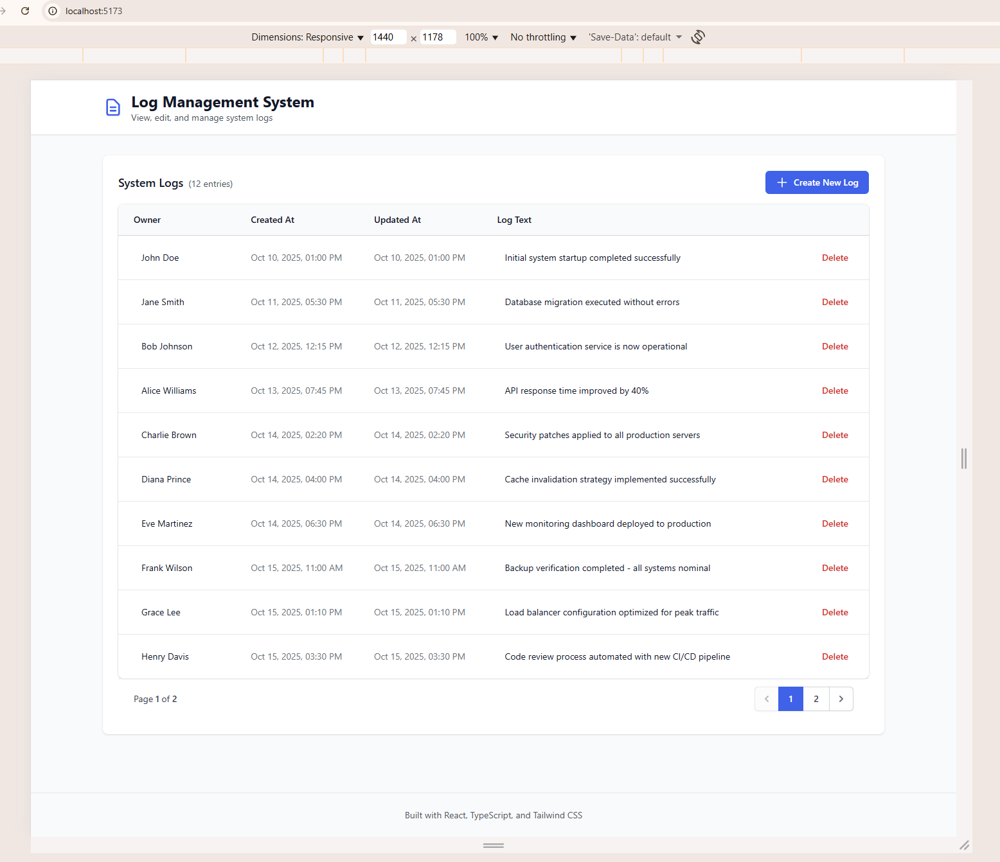

# Log Management System

A full-stack web application for managing system logs built with React, TypeScript, and Tailwind CSS.

> Technical assessment project for Fixar

**Live Demo:** https://fixar-assigment.vercel.app/

**Repository:** https://github.com/YuraLeo94/fixar-assigment

## Features

- Full CRUD operations (Create, Read, Update, Delete)
- Click-to-edit inline editing
- Responsive design (mobile & desktop)
- Pagination for large datasets
- Toast notifications
- Comprehensive unit tests

## Tech Stack

- **Frontend:** React 18, TypeScript, Vite, Tailwind CSS
- **Backend:** Node.js, Express, TypeScript
- **Testing:** Jest, React Testing Library

## Quick Start

### Prerequisites

- Node.js (v18+)
- npm (v9+)

### Installation & Running

```bash
# Clone the repository
git clone https://github.com/YuraLeo94/fixar-assigment.git
cd fixar-assigment

# Install dependencies
cd backend && npm install
cd ../frontend && npm install

# Start backend (terminal 1)
cd backend && npm run dev
# Backend runs on http://localhost:3000

# Start frontend (terminal 2)
cd frontend && npm run dev
# Frontend runs on http://localhost:5173

# Run tests
cd frontend && npm test
```

## API Endpoints

- `GET /api/logs` - Fetch all logs
- `POST /api/logs` - Create a new log (body: `{ owner, logText }`)
- `PUT /api/logs/:id` - Update a log (body: `{ owner?, logText? }`)
- `DELETE /api/logs/:id` - Delete a log

## Project Structure

```
fixar-assigment/
├── frontend/                   # React frontend
│   ├── src/
│   │   ├── __tests__/          # Test files
│   │   ├── api/                # API service layer
│   │   ├── components/         # React components
│   │   ├── contexts/           # React contexts
│   │   ├── hooks/              # Custom hooks
│   │   └── types/              # TypeScript types
│   └── package.json
├── backend/                    # Express backend (shared code)
│   ├── src/
│   │   └── index.ts            # Express app (used locally & on Vercel)
│   └── package.json
├── api/                        # Vercel serverless entry point
│   └── index.ts                # Thin wrapper (imports backend)
├── vercel.json                 # Vercel configuration
└── README.md
```

## Testing

All components, hooks, and API services have unit tests following React Testing Library best practices.

```bash
npm test              # Run all tests
npm test -- --watch   # Watch mode
npm run test:coverage # Coverage report
```

## Screenshots

### Desktop View


### Mobile View


**Note:** The application is fully deployed and interactive at the live demo: https://fixar-assigment.vercel.app/

## Design Notes

**Inline Editing UX:** The task requirements specify editable fields directly in the table (Owner and Log Text columns). While this implementation meets the requirements, inline editing in tables is not optimal for mobile UX. In a production application, a better approach would be using a dedicated edit modal or form, especially for mobile devices. The current implementation prioritizes meeting the assignment specifications while maintaining responsive card layouts for smaller screens.

---

**Author:** [YuraLeo94](https://github.com/YuraLeo94)
